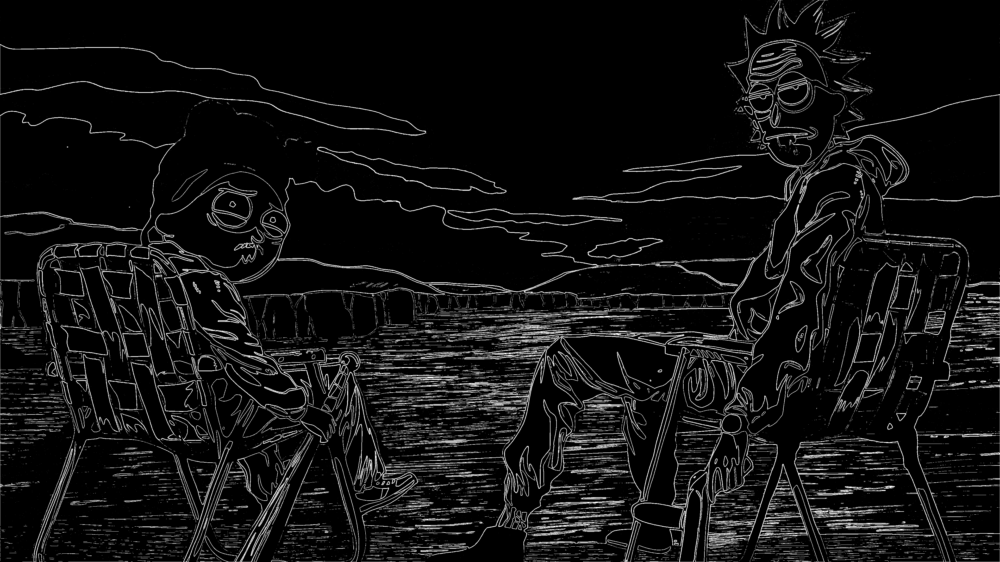
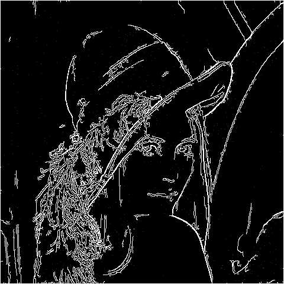

# Canny Edge-Detection
## this algorithm  consists of 5 steps :
        1- RGB to Gray scale
        2-blur operation
        3-sobel operation
        4-non-maximum suppression
        5-hysteresis thresholding

### Here are some results

